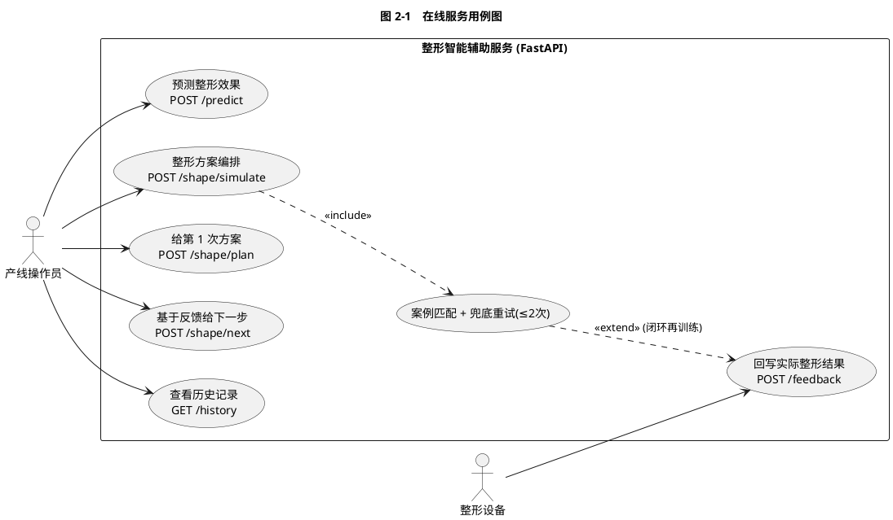
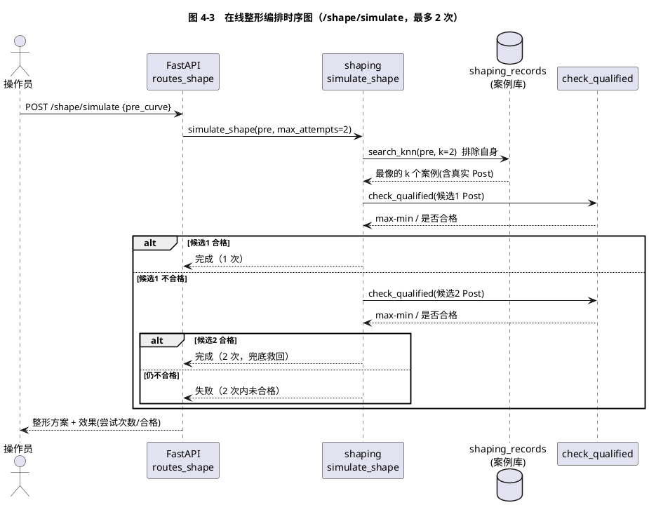
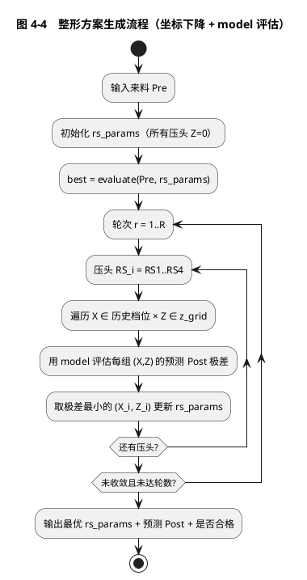

# 基于数据分析与在线服务的铁路产品整形加工智能辅助系统

## 工程实践结题报告

**汇报人**：[姓名]
**指导老师**：[姓名]
**日期**：2026 年 6 月

---

## 目录

1. 引言
2. 需求分析
3. 概要设计
4. 详细设计
5. 系统实现
6. 系统测试
7. 总结与展望

---

## 1. 引言

### 1.1 编写目的

本文档为「铁路产品整形加工智能辅助系统」工程实践项目的结题报告，按软件工程规范阐述项目的需求分析、概要设计、详细设计、系统实现与系统测试，作为项目成果交付与验收依据。

### 1.2 项目背景

本项目源自 **KANGHONG 压力整形机** 对 **CMX611 Rail（铁路产品/轨道）** 的全自动整形加工场景。铁路产品在轧制出厂后存在平面度/直线度超差，需通过压力整形机进行二次校形：将产品两端固定后，由压头在指定位置施加下压量，使产品发生塑性形变，最终满足装配精度要求。

厂商提出的总体算法框架为「**基于塑性力学生成模型的智能整形算法**」（Material Smart Shaping with Physical Deformation Networks），包含三大功能模块：

- **来料分类模块**：将物理属性相近的材料归于一类，整形加工中使用相近参数；
- **几何形态感知模块**：识别材料受力区域与关键点，预测整形后的几何形态；
- **整形量计算模块**：基于来料分类与形态感知，输出各压头的下压量。

本项目是该框架在「数据分析 + 在线服务」侧的工程实践落地。

### 1.3 整形工艺与合格标准

每根产品测量 **20 个点位（P1–P20）** 的偏差值，整形的核心目标是使整形后曲线的极差满足合格判据：

```
max(P1..P20) − min(P1..P20) ≤ 0.1     公式(1-1)
```

实际数据统计表明（测试集 386 个样本）：

- 来料（Pre）合格率 0.0%，max-min 均值 0.246，是阈值的 2.5 倍——来料必须整形；
- 当前工艺整形后合格率 85.8%，max-min 均值 0.079；
- 整形方案较多依赖人工经验，缺乏数据驱动的方案推荐与效果预测。

### 1.4 术语定义

| 术语 | 含义 |
|------|------|
| Pre / Post | 整形前 / 整形后的 20 点位测量曲线 |
| Δ | 整形变化量，Δ = Post − Pre |
| RS1–RS4 | 4 个压头，RSX 为位置、RSZ 为下压量 |
| Shape | 4 段分类标签拼接（如 PPPN） |
| BIN | 来料分类编号，用于指导整形方案 |
| max-min | 20 点位极差，合格判据指标 |

### 1.5 参考资料

- 厂商提供的算法框架资料（Material Smart Shaping）；
- scikit-learn 官方文档（Ridge / MultiOutputRegressor / Pipeline）；
- FastAPI 官方文档；SQLAlchemy 2.0 ORM 文档。

---

## 2. 需求分析

### 2.1 系统目标

围绕项目背景，设定四项系统目标：

1. **来料分类**：实现 4 段特征 + Shape 标签 + BIN 分配的分 BIN 算法，判断「这根产品该怎么整形」；
2. **整形效果预测**：从历史 Pre/Post 配对数据学习压头（RS1–RS4）对 20 个点位的影响规律，建立回归预测模型；
3. **在线服务**：将训练成果包装为 FastAPI + 数据库的 HTTP 服务，实时给出整形方案；
4. **良率保障**：通过案例匹配 + 兜底重试（整形最多 2 次），追求整形后 max-min ≤ 0.1 的良率。

### 2.2 功能需求

系统参与者为产线操作员与整形设备，核心用例覆盖预测、整形编排（含案例匹配+兜底重试）、反馈回写与历史查询（见图 2-1）。



> 图 2-1　在线服务用例图

功能清单：

| 编号 | 功能模块 | 说明 |
|------|---------|------|
| F1 | 来料分类（分 BIN） | 输入 20 点位，输出 Shape 与 BIN |
| F2 | 压头影响预测 | 输入压头参数 + Pre，输出 20 点位 Δ |
| F3 | 案例匹配整形编排 | 检索历史相似案例，复用其整形结果，最多 2 次 |
| F4 | 反馈回写 | 记录实际整形结果，支持闭环再训练 |
| F5 | 历史查询 | 查询预测与整形历史记录 |

### 2.3 非功能需求

- **性能**：单次在线推理响应 < 1s（模型常驻内存）；
- **可维护性**：模块化分层（离线训练 / 在线服务解耦），ruff 代码规范，单元测试覆盖核心逻辑；
- **可扩展性**：数据库 ORM 设计便于迁移 PostgreSQL，模型版本可切换；
- **数据一致性**：推理特征构造与训练严格对齐。

### 2.4 数据需求

- 数据源：`Data/total.csv`，含 Pre/Post 两种状态记录共 5304 条；
- 配对后有效样本：2567 对（Pre/Post 按 Barcode 配对）；
- 每条记录含 20 个测量点（P1–P20）、整体值（FAI156）、4 压头参数（RS1–RS4 的 X/Z）。

### 2.5 设计约束

- 合格判据：整形后 max-min ≤ 0.1（公式 1-1）；
- 整形次数：单根最多 2 次（兜底重试上限）；
- 评估规范：模型评估采用留出测试集（85/15），案例库与测试集严格分离。

---

## 3. 概要设计

### 3.1 总体架构

系统分为「离线训练」与「在线服务」两层（见图 3-1）。

```plantuml
@startuml 图3-1 系统总体架构
title 图 3-1　系统总体架构（离线训练 / 在线服务）
skinparam componentStyle rectangle
package "离线 · 一次性" {
  file "total.csv\n(历史 Pre/Post)" as csv
  component "DataLoader\n配对 2567 对" as loader
  component "FeatureEngineer\n26 特征" as fe
  component "ModelTrainer\nRidge 训练" as train
  artifact "model.pkl / scaler.pkl /\nfeature_names.json" as model
}
package "在线 · 常驻" {
  component "FastAPI 服务" as api
  component "/predict\n模型预测 Δ" as predict
  component "/shape\n整形编排(≤2次)" as shape
  database "数据库\n(prediction_logs /\nshaping_records / feedbacks)" as db
}
actor "HTTP 请求\n(来料 Pre 曲线)" as req
csv --> loader --> fe --> train --> model
model ..> api : 启动加载
req --> api
api --> predict
api --> shape
shape --> db : 读案例库 / 写记录
predict --> db : 写预测日志
@enduml
```

> 图 3-1　系统总体架构

### 3.2 模块划分

| 子系统 | 职责 | 主要模块 |
|--------|------|---------|
| 离线训练 | 数据配对、特征工程、模型训练、持久化 | `rs_impact_analyzer.py`、`rail_binning_algorithm.py` |
| 在线服务 | 推理、整形编排、反馈闭环 | `app.py`、`predictor.py`、`shaping.py`、`api/` |
| 数据存储 | 历史案例库、预测日志、反馈 | `db/`（SQLAlchemy + SQLite） |

### 3.3 技术选型

> 表 3-1　技术选型

| 层 | 选型 | 理由 |
|----|------|------|
| 数值/数据 | numpy / pandas | 标准数据处理栈 |
| 机器学习 | scikit-learn（Ridge / MultiOutputRegressor）| 多输出回归，可解释 |
| Web 服务 | FastAPI + Uvicorn | 异步、Pydantic 校验、自动 OpenAPI 文档 |
| 数据库 | SQLAlchemy + SQLite | 零配置起步，ORM 便于迁移 PostgreSQL |
| 模型持久化 | joblib | sklearn 标配 |
| 代码规范 | ruff | lint + format 一体化 |

### 3.4 数据流设计

1. **离线**：`total.csv` → DataLoader 按 Barcode 配对 Pre/Post → FeatureEngineer 构造 26 特征 → ModelTrainer 训练 Ridge → ResultExporter 持久化 `model.pkl/scaler.pkl/feature_names.json`；历史配对导入 `shaping_records` 表。
2. **在线**：`/shape/simulate` 收来料 Pre → 案例匹配检索最像的 k 个历史案例 → 复用其真实整形结果 → 检查合格（max-min ≤ 0.1）→ 不合格则换次像案例（兜底，最多 2 次）。

### 3.5 数据库概要设计

4 张核心表（SQLAlchemy ORM，SQLite），详细字段见 4.5 节。

> 表 3-2　核心数据表概要

| 表 | 用途 |
|----|------|
| `prediction_logs` | 预测请求审计日志（含 `attempt` 字段记录第几次整形）|
| `shaping_records` | 历史整形记录（Pre/rs_params/Post），案例匹配检索源 |
| `model_registry` | 模型版本管理（`is_active` 标记当前线上模型）|
| `feedbacks` | 实际整形结果反馈，支持闭环与再训练 |

---

## 4. 详细设计

### 4.1 来料分类模块（分 BIN）

**核心类** `RailBinningCore`（`rail_binning_algorithm.py`），4 段特征值计算流程见图 4-1。

```plantuml
@startuml 图4-1 分BIN算法流程
title 图 4-1　分 BIN 算法流程（RailBinningCore）
start
:输入 P1..P20;
partition "① preprocess 预处理" {
  :整体值分类 BINOK(<0.1) / BIN100(>0.8);
  :最小二乘拟合 P1-P14;
}
partition "② 4 段特征值 e1~e4" {
  :段1 P1-P4   : 端点差值 = P1 − P4;
  :段2 P5-P8   : 直线度拟合（最大偏差）;
  :段3 P9-P16  : 直线度拟合;
  :段4 P17-P20 : 端点差值 = P20 − P17;
}
partition "③ 分类" {
  if (特征值 e ≥ 阈值?) then (是) :P; else (否) :N; endif
  if (最小二乘拟合 < 0.018?) then (是) :前三段记 MMM; endif
}
partition "④ BIN 映射" {
  :Shape → BIN1~16;
  :MMM → BIN17 / BIN18;
}
:输出 BIN（共 20 种）;
stop
@enduml
```

> 图 4-1　分 BIN 算法流程

V4 版针对变化最大的段 3，改为物理意义驱动的 4 类分类，核心判据见公式 4-1 ~ 4-3：

```
trend      = (P17 − P9) / 8                              公式(4-1)
std_dev    = std(P9..P16)                                公式(4-2)
slope_diff = | slope(P13..P17) − slope(P9..P13) |        公式(4-3)
```

分类优先级：`std_dev<0.03→FLAT` → `trend>0.015→ARC_UP` → `trend<−0.015→ARC_DOWN` → `std_dev≥0.08→WAVE` → 兜底按 slope_diff/趋势归类。

> 表 4-1　分 BIN 算法版本对比

| 版本 | 段 3 方法 | 标签粒度 |
|------|----------|---------|
| 基础版 `rail_binning_algorithm.py` | 直线度拟合 | 二值 P/N |
| V4 版 `rail_binning_algorithm_v4.py` | 物理 4 类分类 | 四值 FLAT/ARC_UP/ARC_DOWN/WAVE |

### 4.2 压头影响分析模块

**5 类流水线** `RSImpactAnalyzer`（`rs_impact_analyzer.py`）：

> 表 4-2　压头影响分析流水线

| 类 | 职责 |
|----|------|
| DataLoader | 按 Barcode 配对 Pre/Post，Δ=Post−Pre |
| FeatureEngineer | 构造 26 特征（13 位置 + 7 Pre 曲线 + 6 交互）|
| ModelTrainer | 划分 85/15、5 折交叉验证选 alpha、训练 Ridge |
| ResultExporter | 导出影响系数、指标、预测、持久化模型 |
| RSImpactAnalyzer | 编排整条流水线 |

位置特征构造见公式 4-4：

```
X_{h,pos} = RS_hZ × 1[RS_hX == pos]     公式(4-4)
```

模型采用 Ridge 多输出回归（MultiOutputRegressor），5 折交叉验证选择正则化参数 alpha，85/15 留出测试集评估，用于整形效果预测。

### 4.3 在线推理服务

**推理模块** `ImpactPredictor`（`predictor.py`）：启动时加载 `model.pkl/scaler.pkl/feature_names.json` 常驻内存（`lru_cache` 单例），`predict(rs_params, pre_curve)` 按训练时一致的特征顺序构造 26 特征 → 标准化 → 模型预测 → 返回 20 点位 Δ。

**FastAPI 服务** `app.py`，核心端点：

> 表 4-3　在线服务端点

| 方法 | 路径 | 功能 |
|------|------|------|
| POST | `/predict` | 输入压头参数 + Pre 曲线，返回 20 点位 Δ 预测 |
| POST | `/shape/simulate` | 案例匹配模拟整形，最多 2 次 |
| POST | `/shape/plan` | 模式 B：给第 1 次整形方案 |
| POST | `/shape/next` | 模式 B：基于实际反馈判断下一步 |
| POST | `/shape/generate` | 模式 C：model 反推最优压头参数 |
| POST | `/feedback` | 回写实际整形结果 |
| GET  | `/health` `/history` | 健康检查 / 历史记录 |

### 4.4 案例匹配与兜底重试

**相似度检索**：对来料 Pre 曲线，按欧氏距离检索历史 `shaping_records` 中最像的 k 个案例（见公式 4-5）：

```
distance(Pre, Pre_i) = ‖Pre − Pre_i‖₂     公式(4-5)
```

**兜底重试流程**（最多 2 次整形，见图 4-2）。


> 图 4-2　案例匹配兜底重试流程（最多 2 次）

**在线整形编排时序图**（图 4-3）：`/shape/simulate` 的调用序列——FastAPI 收请求 → 案例库 k-NN 检索 → 复用真实 Post 判合格 → 不合格则兜底取次像案例。



> 图 4-3　在线整形编排时序图

### 4.5 整形方案生成（整形量计算 / model 反推）

案例匹配（4.4）复用历史相似案例给出方案，本质是「检索」；当来料在历史库中无足够相似案例时，需由模型主动「计算」方案。本模块（`planner.py`）实现厂商框架的「整形量计算」：给定来料 Pre，用压头影响模型评估候选方案效果，搜索使预测整形后曲线合格的最优压头参数。

**方案效果评估**（model 进入决策闭环）：给定 Pre 与候选压头参数 `rs_params`，模型预测整形变化量 Δ，得到预测整形后曲线 Post 与合格性（公式 4-6、4-7）：

```
Δ = model.predict(rs_params, Pre)                          公式(4-6)
qualified ⟺ max(Post) − min(Post) ≤ 0.1,  Post = Pre + Δ   公式(4-7)
```

模型用于「方案间相对比较、选最优」，其预测的系统性偏差不影响选优，故此处可信（区别于良率放行——后者需预测绝对值准确，仍以案例匹配覆盖度评估为准）。

**最优参数搜索**（坐标下降，见图 4-4）：轮流优化每个压头 RS_i 的（位置 X、下压量 Z），固定其他压头当前值；每轮对该压头遍历其历史 X 档位 × Z 网格，按公式 4-7 取使预测 Post 极差最小的 (X, Z)，迭代至收敛。X 候选档位从持久化 `feature_names` 反推，与训练一致。



> 图 4-4　整形方案生成流程（坐标下降）

### 4.6 数据库详细设计

数据库 ER 图见图 4-5，4 张表及主要外键关系（`prediction_logs.feedback_id` ↔ `feedbacks.id`，`feedbacks.prediction_id` ↔ `prediction_logs.id`）。


> 图 4-5　数据库 ER 图

---

## 5. 系统实现

### 5.1 开发与运行环境

- **语言/运行时**：Python 3.12；
- **依赖**：见 `requirements.txt`（pandas / numpy / scikit-learn / fastapi / uvicorn / sqlalchemy / joblib / ruff / pytest）；
- **目录结构**：根目录核心算法（分 BIN / 压头分析 / 整形编排 / 推理），`api/` 在线路由，`db/` 数据库，`constants/` 配置常量，`utils/` 辅助工具。

### 5.2 核心算法实现要点

- **分 BIN**：4 段特征（段 1/4 端点差值法、段 2/3 直线度拟合），MMM 规则（最小二乘拟合 < 0.018 时前三段记 MMM → BIN17/BIN18）；
- **压头影响预测**：26 维特征（位置桶特征 + Pre 曲线全局特征 + 压头交互项），Ridge 多输出回归；
- **案例匹配**：欧氏距离 k-NN，复用历史真实 Post 作为整形效果；
- **兜底重试**：第 1 次不合格则换次像案例，最多整形 2 次。

### 5.3 工程化实践

- **统一路径管理**：`paths.py` 锚定项目根目录，所有脚本经统一路径定位数据与输出，任意工作目录下均可运行；
- **代码规范**：ruff lint + format 全量通过；
- **分层解耦**：离线训练 / 在线服务 / 数据存储三层独立，在线服务不依赖训练代码运行时。

---

## 6. 系统测试

### 6.1 测试环境与方法

- **单元测试**：pytest，20 个用例 / 6 个测试文件，覆盖分 BIN 分类、段 3 物理分类、案例匹配与兜底重试、推理特征对齐；
- **模型评估**：留出测试集 85/15（训练 2181 / 测试 386），案例库与测试集严格分离；
- **端到端验证**：全部脚本在数据源 `Data/total.csv` 上可运行。

### 6.2 模型评估

压头影响 Ridge 模型（测试集 386 样本）：

> 表 6-1　模型性能指标

| 指标 | 训练集 | 测试集 |
|------|--------|--------|
| 最佳 Alpha | 1.0 | — |
| 平均 R² | 0.7759 | **0.8848** |
| 平均 RMSE | 0.0190 | **0.0153** |

测试集 R²=0.88，模型对压头影响的预测能力满足整形效果预测需求。

### 6.3 良率评估

案例匹配策略（k=2，最多整形 2 次），严格训练/测试分割评估（案例库=训练集 2181，测试集 386 完全陌生，`eval_yield.py` 可复现）：

> 表 6-2　案例匹配良率评估（`eval_yield.py`，random_state=42）

| 评估口径 | 数值 | 需第 2 次救回 |
|---------|------|--------------|
| 工厂工艺实测基线（测试集历史 Post） | 85.8% | — |
| k=1 覆盖度上界 | 88.9% | 0 |
| **k=2 覆盖度上界** | **94.8%** | 23 |
| k=3 覆盖度上界 | 96.6% | 30 |

**说明**：上表中的覆盖度上界复用历史相似案例的真实整形结果评估，为案例库覆盖能力指标，非真实整形良率；策略相对工厂工艺的真实增益待实测闭环数据验证。

### 6.4 合规判据验证

整形后 20 点位 max-min ≤ 0.1 的合格判据已贯穿训练、评估、在线服务全流程（`check_qualified` 函数），端到端验证通过。

### 6.5 测试结论

- **模型**：测试集 R²=0.88，满足整形效果预测需求；
- **良率**：案例匹配 k=2 覆盖度上界 94.8%，案例库对绝大多数来料可检索到形状相似的合格方案；
- **工程化**：单元测试全绿、脚本端到端可运行、合规判据贯穿全流程。

---

## 7. 总结与展望

### 7.1 工作总结

本项目完成了铁路产品整形加工的「数据分析 + 在线服务」工程实践：

1. **来料分类**：实现分 BIN 算法（基础版 + V4 物理分类），20 种 BIN 覆盖来料形态；
2. **整形预测**：Ridge 多输出回归模型（测试集 R²=0.88），用于整形效果预测与方案反推（`/shape/generate`，模型进入决策闭环）；
3. **在线服务**：FastAPI + 数据库，7 个端点，含案例匹配与兜底重试；
4. **良率评估**：案例匹配 k=2 策略覆盖度上界 94.8%（≤ 2 次整形）。

### 7.2 不足与展望

1. **方案优化**：已实现基于模型的方案反推（`/shape/generate`，坐标下降搜索使预测 Post 合格的压头参数），未来可扩展为连续优化（贝叶斯/梯度）与多目标（如下压量最小化）；
2. **相似度增强**：欧氏距离可升级为加权距离或曲线形态特征（峰谷、曲率）匹配；
3. **闭环再训练**：`feedbacks` 积累后，周期性重训并切换 `model_registry` 活跃版本；
4. **部署运维**：Docker 化 + PostgreSQL，支撑产线长期运行；
5. **未覆盖来料**：分析案例匹配未能覆盖的来料 Pre 形态特征，针对性扩展案例库或方案空间。

---

*本报告所涉算法实现详见 `rail_binning_algorithm.py`、`rail_binning_algorithm_v4.py`、`rs_impact_analyzer.py`、`shaping.py`、`predictor.py`、`app.py` 及 `db/`、`api/` 模块。*
