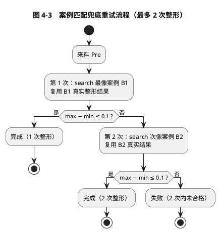
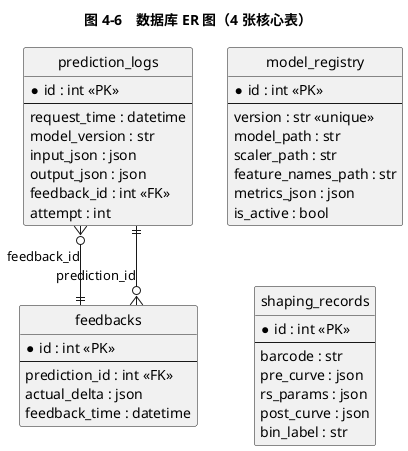

# 基于数据分析与在线服务的铁路产品整形加工智能辅助系统

## 工程实践结题报告

**汇报人**：[姓名]
**指导老师**：[姓名]
**日期**：2026 年 6 月

---

## 目录

1. 项目背景和需求
2. 算法与技术对比
3. 设计思路和技术路线
4. 详细设计与功能实现
5. 成果展示
6. 总结与展望

---

## 1. 项目背景和需求

### 1.1 行业背景

本项目源自 **KANGHONG 压力整形机** 对 **CMX611 Rail（铁路产品/轨道）** 的全自动整形加工场景。铁路产品在轧制出厂后存在平面度/直线度超差，需通过压力整形机进行二次校形：将产品两端固定后，由压头在指定位置施加下压量，使产品发生塑性形变，最终满足装配精度要求。

厂商提出的总体算法框架为「**基于塑性力学生成模型的智能整形算法**」（Material Smart Shaping with Physical Deformation Networks），包含三大功能模块：

- **来料分类模块**：将物理属性相近的材料归于一类，整形加工中使用相近参数；
- **几何形态感知模块**：识别材料受力区域与关键点，预测整形后的几何形态；
- **整形量计算模块**：基于来料分类与形态感知，输出各压头的下压量。

本项目是该框架在「数据分析 + 在线服务」侧的工程实践落地。

### 1.2 整形工艺与合格标准

每根产品测量 **20 个点位（P1–P20）** 的偏差值，整形的核心目标是使整形后曲线的最大值与最小值之差满足：

> **max(P1..P20) − min(P1..P20) ≤ 0.1**  　　（合格判据，见公式 1-1）

实际数据统计表明（测试集 386 个样本）：

- **来料（Pre）合格率 0.0%**，max-min 均值 0.246，是阈值的 2.5 倍——来料必须整形；
- **当前工艺整形后真实合格率 85.8%**，max-min 均值 0.079；
- 整形方案目前较多依赖人工经验，缺乏数据驱动的方案推荐与效果预测。

### 1.3 项目目标

围绕上述背景，本项目设定四项目标：

1. **来料分类**：实现 4 段特征 + Shape 标签 + BIN 分配的分 BIN 算法，判断「这根产品该怎么整形」；
2. **整形效果预测**：从历史 Pre/Post 配对数据学习压头（RS1–RS4）对 20 个点位的影响规律，建立 Ridge 回归预测模型；
3. **在线服务**：将训练成果包装为 FastAPI + 数据库的 HTTP 服务，实时给出整形方案；
4. **良率保障**：通过案例匹配 + 兜底重试（整形最多 2 次），追求整形后 max-min ≤ 0.1 的良率达到 90% 以上（当前以**覆盖度上界**评估达 94.8%；85.8% 为工厂工艺实测基线；真实整形良率待实测闭环验证）。

---

## 2. 算法与技术对比

### 2.1 来料分类算法：分 BIN 算法演进

分 BIN 算法将来料 20 点位曲线压缩为 Shape 标签再映射到 BIN，经历了版本演进（见图 2-1）：

- **基础版 `rail_binning_algorithm.py`**：4 段特征——段 1（P1−P4）、段 4（P17−P20）用端点差值法；段 2、段 3 用直线度拟合（保留符号取绝对值最大偏差）；最小二乘拟合值 < 0.018 时前三段记 MMM → BIN17/BIN18。
- **V4 版 `rail_binning_algorithm_v4.py`**：针对变化最大的段 3，改为物理意义驱动的 4 类分类：FLAT（平缓）/ ARC_UP（上凸）/ ARC_DOWN（下凹）/ WAVE（剧烈波动），基于趋势、标准差、斜率差三类特征判定。由于段 3 标签是物理类（A/R/F/W/U）而非 P/N，V4 的 BIN 输出集合为 **BINOK/BIN100/BIN17/BIN18/UNKNOWN**（基于整体值 + MMM，不含 BIN1–16）；基础版则输出完整的 BIN1–16 + OK/100/17/18/UNKNOWN。

| 版本 | 段 3 方法 | 标签粒度 |
|------|----------|---------|
| 基础版 | 直线度拟合 | 二值 P/N |
| V4 版 | 物理 4 类分类 | 四值 FLAT/ARC_UP/ARC_DOWN/WAVE |

> 图 2-1　分 BIN 算法演进对比

### 2.2 整形方案来源对比（关键发现）

厂商资料中整形量计算提到 LSTM 等时序模型。本项目对「方案来源」做了对比实验，得到一项关键结论（见表 2-1）：

| 方案来源 | 评估方式 | 良率 |
|---------|---------|------|
| **Ridge 模型预测 Δ** | 用预测 Δ 模拟整形 | 97.7%（虚高）|
| **案例匹配（k-NN，复用真实 Post）** | 用历史真实整形结果 | **94.8%（覆盖度上界）** |

**关键发现**：Ridge 模型（测试集 R²=0.88）预测的 Δ 系统性偏平直，导致模拟良率虚高（97.7% vs 真实 85.8%），**不能直接用于良率评估与放行**。改用**案例匹配**——对来料 Pre 检索历史最像的案例，复用其真实整形结果；但复用历史 Post 得到的是良率**覆盖度上界**（含乐观偏差，非真实整形良率，详见 5.2）。

**补充验证（压头影响模型的优化探索）**：曾尝试用「距离核特征 + 工况分模型」（`rs_impact_analyzer_v2.py`）进一步降低 RMSE。早期因 StandardScaler 在全量数据上 fit 且无留出测试集，出现数据泄露，误报「优化使 RMSE 下降」。修正泄露（Pipeline 每折独立 fit + 85/15 留出测试集）后，可信指标表明**该优化无改进**——基线（位置桶特征）RMSE≈0.0117，距离核优化 RMSE≈0.0129 反而略升。结论：基线 26 特征已足够，距离核方案不采纳；线上模型与报告指标均以 `rs_impact_analyzer.py`（v1）的可信留出评估为准。

> 表 2-1　整形方案来源对比

### 2.3 在线服务技术栈对比

参考既有同类系统（smart_shape，Flask 实现）与本项目对比（见表 2-2）：

| 维度 | 既有系统 smart_shape | 本项目 |
|------|---------------------|--------|
| Web 框架 | Flask（同步） | **FastAPI**（异步 + 自动文档）|
| 状态管理 | 全局变量（并发不安全）| **数据库**（SQLite/SQLAlchemy）|
| 决策核心 | PID 实时调节 | 案例匹配 + 模型预测 |
| 反馈闭环 | 无 | `/feedback` 回写，支持再训练 |
| 重试机制 | 无 | 兜底重试，整形最多 2 次 |

> 表 2-2　在线服务技术栈对比

---

## 3. 设计思路和技术路线

### 3.1 总体架构

系统分为「离线训练」与「在线服务」两层（见图 3-1）：

```plantuml
@startuml 图3-1 系统总体架构
title 图 3-1　系统总体架构（离线训练 / 在线服务）
skinparam componentStyle rectangle
package "离线 · 一次性" {
  file "total.csv\n(历史 Pre/Post)" as csv
  component "DataLoader\n配对 2567 对" as loader
  component "FeatureEngineer\n26 特征" as fe
  component "ModelTrainer\nRidge 训练" as train
  artifact "model.pkl / scaler.pkl /\nfeature_names.json" as model
}
package "在线 · 常驻" {
  component "FastAPI 服务" as api
  component "/predict\n模型预测 Δ" as predict
  component "/shape\n整形编排(≤2次)" as shape
  database "数据库\n(prediction_logs /\nshaping_records / feedbacks)" as db
}
actor "HTTP 请求\n(来料 Pre 曲线)" as req
csv --> loader --> fe --> train --> model
model ..> api : 启动加载
req --> api
api --> predict
api --> shape
shape --> db : 读案例库 / 写记录
predict --> db : 写预测日志
@enduml
```

> 图 3-1　系统总体架构

### 3.2 数据流

1. **离线**：`total.csv` → DataLoader 按 Barcode 配对 Pre/Post → FeatureEngineer 构造 26 特征 → ModelTrainer 训练 Ridge → ResultExporter 持久化 `model.pkl/scaler.pkl/feature_names.json`；历史配对导入 `shaping_records` 表。
2. **在线**：`/shape/simulate` 收来料 Pre → 案例匹配检索最像的 k 个历史案例 → 复用其真实整形结果 → 检查合格（max-min ≤ 0.1）→ 不合格则换次像案例（兜底，最多 2 次）。

### 3.3 技术选型

| 层 | 选型 | 理由 |
|----|------|------|
| 数值/数据 | numpy / pandas | 标准数据处理栈 |
| 机器学习 | scikit-learn（Ridge / MultiOutputRegressor）| 多输出回归，可解释 |
| Web 服务 | FastAPI + Uvicorn | 异步、Pydantic 校验、自动 OpenAPI 文档 |
| 数据库 | SQLAlchemy + SQLite | 零配置起步，ORM 便于迁移 PostgreSQL |
| 模型持久化 | joblib | sklearn 标配 |
| 代码规范 | ruff | lint + format 一体化 |

---

## 4. 详细设计与功能实现

### 4.1 来料分类模块（分 BIN）

**核心类** `RailBinningCore`（`rail_binning_algorithm.py`），4 段特征值计算流程：

```plantuml
@startuml 图4-1 分BIN算法流程
title 图 4-1　分 BIN 算法流程（RailBinningCore）
start
:输入 P1..P20;
partition "① preprocess 预处理" {
  :整体值分类 BINOK(<0.1) / BIN100(>0.8);
  :最小二乘拟合 P1-P14;
}
partition "② 4 段特征值 e1~e4" {
  :段1 P1-P4   : 端点差值 = P1 − P4;
  :段2 P5-P8   : 直线度拟合（最大偏差）;
  :段3 P9-P16  : 直线度拟合;
  :段4 P17-P20 : 端点差值 = P20 − P17;
}
partition "③ 分类" {
  if (特征值 e ≥ 阈值?) then (是) :P; else (否) :N; endif
  if (最小二乘拟合 < 0.018?) then (是) :前三段记 MMM; endif
}
partition "④ BIN 映射" {
  :Shape → BIN1~16;
  :MMM → BIN17 / BIN18;
}
:输出 BIN（共 20 种）;
stop
@enduml
```

> 图 4-1　分 BIN 算法流程

V4 版段 3 物理分类的核心判据（见公式 4-1 ~ 4-3）：

```
trend     = (P17 − P9) / 8           （整体趋势）　　公式 4-1
std_dev   = std(P9..P16)             （段内离散）　　公式 4-2
slope_diff = | slope(P13..P17) − slope(P9..P13) |   （转折程度）公式 4-3
```

分类优先级：`std_dev<0.03→FLAT` → `trend>0.015→ARC_UP` → `trend<−0.015→ARC_DOWN` → `std_dev≥0.08→WAVE` → 兜底按 slope_diff/趋势归类。

### 4.2 压头影响分析模块

**5 类流水线** `RSImpactAnalyzer`（`rs_impact_analyzer.py`）：

| 类 | 职责 |
|----|------|
| DataLoader | 按 Barcode 配对 Pre/Post，Δ=Post−Pre |
| FeatureEngineer | 构造 26 特征（13 位置 + 7 Pre 曲线 + 6 交互）|
| ModelTrainer | 划分 85/15、5 折交叉验证选 alpha、训练 Ridge |
| ResultExporter | 导出影响系数、指标、预测、**持久化模型** |
| RSImpactAnalyzer | 编排整条流水线 |

位置特征构造（见公式 4-4）：

```
X_{h,pos} = RS_hZ × 1[RS_hX == pos]     公式 4-4
```

### 4.3 在线推理服务

**推理模块** `ImpactPredictor`（`predictor.py`）：启动时加载 `model.pkl/scaler.pkl/feature_names.json` 常驻内存（`lru_cache` 单例），`predict(rs_params, pre_curve)` 按训练时一致的特征顺序构造 26 特征 → 标准化 → 模型预测 → 返回 20 点位 Δ。

**FastAPI 服务** `app.py`，核心端点：

| 方法 | 路径 | 功能 |
|------|------|------|
| POST | `/predict` | 输入压头参数 + Pre 曲线，返回 20 点位 Δ 预测 |
| POST | `/shape/simulate` | 案例匹配模拟整形，最多 2 次 |
| POST | `/shape/plan` | 模式 B：给第 1 次整形方案 |
| POST | `/shape/next` | 模式 B：基于实际反馈判断下一步 |
| POST | `/feedback` | 回写实际整形结果 |
| GET  | `/health` `/history` | 健康检查 / 历史记录 |

> 图 4-2　在线服务端点结构

**在线服务用例图（图 4-4）**：参与者为产线操作员与整形设备，核心用例覆盖预测、整形编排（含案例匹配+兜底重试）、反馈回写与历史查询。


> 图 4-4　在线服务用例图

### 4.4 案例匹配与兜底重试（核心创新）

**相似度检索**：对来料 Pre 曲线，按欧氏距离检索历史 `shaping_records` 中最像的 k 个案例（见公式 4-5）：

```
distance(Pre, Pre_i) = ‖Pre − Pre_i‖₂     公式 4-5
```

**兜底重试流程（最多 2 次整形，见图 4-3）**：



> 图 4-3　案例匹配兜底重试流程（最多 2 次）

**在线整形编排时序图（图 4-5）**：`/shape/simulate` 的调用序列——FastAPI 收请求 → 案例库 k-NN 检索 → 复用真实 Post 判合格 → 不合格则兜底取次像案例。


> 图 4-5　在线整形编排时序图

### 4.5 数据库设计

4 张核心表（SQLAlchemy ORM，SQLite）：

| 表 | 用途 |
|----|------|
| `prediction_logs` | 预测请求审计日志（含 `attempt` 字段记录第几次整形）|
| `shaping_records` | 历史整形记录（Pre/rs_params/Post），案例匹配检索源 |
| `model_registry` | 模型版本管理（`is_active` 标记当前线上模型）|
| `feedbacks` | 实际整形结果反馈，支持闭环与再训练 |

**数据库 ER 图（图 4-6）**：4 张表及主要外键关系（`prediction_logs.feedback_id` ↔ `feedbacks.id`，`feedbacks.prediction_id` ↔ `prediction_logs.id`）。



> 图 4-6　数据库 ER 图

---

## 5. 成果展示

### 5.1 模型性能

压头影响 Ridge 模型（测试集 386 样本）：

| 指标 | 训练集 | 测试集 |
|------|--------|--------|
| 最佳 Alpha | 1.0 | — |
| 平均 R² | 0.7759 | **0.8848** |
| 平均 RMSE | 0.0190 | **0.0153** |

> 表 5-1　模型性能指标

### 5.2 案例匹配覆盖度评估

案例匹配策略（k=2，最多整形 2 次），严格训练/测试分割评估（案例库=训练集 2181，测试集 386 完全陌生，`eval_yield.py` 可复现）：

| 评估口径 | 数值 | 需第 2 次救回 |
|---------|------|--------------|
| 工厂工艺实测基线（测试集历史 Post） | **85.8%**（唯一真实数，非本项目策略良率） | — |
| k=1 覆盖度上界 | 88.9% | 0 |
| **k=2 覆盖度上界** | **94.8%** | 23 |
| k=3 覆盖度上界 | 96.6% | 30 |

> 表 5-2　案例匹配评估（`eval_yield.py`，random_state=42）

⚠️ **口径说明（乐观偏差）**：覆盖度上界复用历史相似案例的真实 Post 作为「来料整形后曲线」，隐含「相似来料整形结果可移植」假设，故为**上界**，**非**用推荐方案真实整形这根来料的良率（后者需仿真或实测闭环数据，项目均无）。注意 85.8% 是**工厂现有工艺**的历史实测合格率（参照基线），**非本项目策略的良率**，也**非数学下界**——本项目策略的真实整形良率夹在 85.8%（工厂基线）与 94.8%（覆盖度上界）之间，**真值未知**，相对工厂工艺的真实增益**待实测验证**。

**结论**：k=2 时案例库覆盖度上界达 94.8%（88.9% 第 1 次命中，5.9% 由第 2 次兜底），说明案例库对绝大多数来料能检索到形状相似的合格历史方案；但这是**覆盖度而非真实整形良率**。

### 5.3 系统规模与工程化

- 代码：40 余个 `.py` 模块（根目录 + `api/` + `db/` + `constants/`），核心含分 BIN / 压头分析 / 在线服务三大子系统；
- 工程实践：`requirements.txt` 依赖声明、`paths.py` 统一路径、`ruff` lint 全绿、**20 个 `pytest` 单元测试（6 个测试文件，覆盖分 BIN、段 3 物理分类、案例匹配兜底重试、推理特征对齐）**、`.gitignore` 规范；全部脚本（含 4 段验证、V4 可视化、BIN 可视化、训练过程演示）经修复后在 canonical 数据源 `Data/total.csv` 上端到端跑通；
- 文档：README + docs/ 算法文档，已与代码对齐。

### 5.4 合规判据验证

整形后 20 点位 max-min ≤ 0.1 的判据已贯穿训练、评估、在线服务全流程（`check_qualified` 函数），端到端验证通过。

---

## 6. 总结与展望

### 6.1 总结

本项目完成了铁路产品整形加工的「数据分析 + 在线服务」工程实践：

1. **来料分类**：实现分 BIN 算法（基础版 + V4 物理分类），20 种 BIN 覆盖来料形态；
2. **整形预测**：Ridge 多输出回归模型，测试集 R²=0.88；
3. **在线服务**：FastAPI + 数据库，7 个端点，含案例匹配与兜底重试；
4. **良率评估**：案例匹配 k=2 策略的案例库覆盖度上界 94.8%（≤ 2 次整形，`eval_yield.py` 可复现）；85.8% 为**工厂现有工艺的历史实测合格率**（参照基线，非本项目策略良率）；本项目策略的真实整形良率**未知**（无仿真/实测闭环），相对工厂工艺的真实增益待实测验证。

**关键工程发现**：①模型预测 Δ 系统性虚高，不能直接用于良率放行；②案例匹配复用历史 Post 得到的是覆盖度上界（乐观偏差），亦非真实整形良率——两者均非可信真实良率，真实增益只能靠实测闭环（`feedbacks`）数据验证。

### 6.2 展望

1. **方案优化**：当前案例匹配给历史方案，未来可用模型反推最优压头参数（给定 Pre，搜索使 Post 合格的 rs_params）；
2. **相似度增强**：欧氏距离可升级为加权距离或曲线形态特征（峰谷、曲率）匹配；
3. **闭环再训练**：`feedbacks` 积累后，周期性重训并切换 `model_registry` 活跃版本；
4. **部署运维**：Docker 化 + PostgreSQL，支撑产线长期运行；
5. **剩余 5.2% 难样本**：分析其 Pre 形态特征，针对性扩展案例库或方案空间。

---

*本报告所涉算法实现详见 `rail_binning_algorithm.py`、`rail_binning_algorithm_v4.py`、`rs_impact_analyzer.py`、`shaping.py`、`predictor.py`、`app.py` 及 `db/`、`api/` 模块。*
